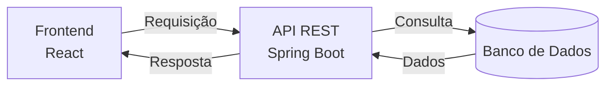

# Product Management

Aplicação full-stack para gerenciamento de produtos com autenticação, painel administrativo e API REST.

 <div> 
        
          
        
         
         
         
         
    </div> 

## Visão Geral 

Product Management é uma aplicação web para gerenciamento de produtos, fornecedores e clientes. O sistema utiliza arquitetura desacoplada entre frontend e backend, oferecendo autenticação, documentação da API e uma interface orientada à produtividade.

## Funcionalidades

- Gestão de produtos
- Gestão de fornecedores
- Gestão de clientes
- Autenticação e controle de acesso
- API REST documentada
- Interface responsiva
- Arquitetura desacoplada


## Documentação da API

Swagger disponível em:

```txt 
http://localhost:8080/swagger-ui.html
```


## Capturas de Tela

<div align="center">
  
  ### Página de Login


_Página de Login com proteção de rotas._

<h2></h2>

  ### Página Principal do Sistema


_Página Principal, disponível a navegação entre as funcionalidades do sistema._

<h2></h2>

### Função para adicionar Produto


_Tela para adicionar novos produtos._

</div>

## Arquitetura



</div>

<h2></h2>

<h3>Conclusão</h3> 
<p> O <strong>Product Management</strong> demonstra a integração eficaz entre <strong>Spring Boot</strong> e <strong>React</strong> na criação de uma aplicação web moderna, robusta e escalável para o gerenciamento de produtos, fornecedores e clientes. A combinação de um backend seguro e bem documentado, com um frontend responsivo e intuitivo, proporciona uma experiência completa ao usuário e uma base sólida para futuras expansões do sistema. Este projeto consolida boas práticas de desenvolvimento Full Stack, explorando tecnologias atuais e abordagens profissionais voltadas à performance, organização e usabilidade. </p>
